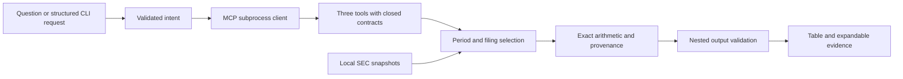

# Follow an answer through the system

Run:

```sh
python3 -B -m financial_metrics analyze --years 2025 --metrics operating_margin --details
```

Apple FY2025 operating income is $133,050,000,000 and revenue is $416,161,000,000. The result divides the first by the second and multiplies by 100: **31.97%** at display precision. Expand the HTML evidence or use `--json` to inspect the exact fraction and both filing records.

The [source statement](https://www.sec.gov/Archives/edgar/data/320193/000032019325000079/aapl-20250927.htm) is printed in millions. The API values already use full dollars. The renderer divides by one million for the compact table; the calculation never rescales the API values.



## Read the code in this order

1. `financial_metrics/policy.py`: the two issuer profiles, reviewed fiscal intervals, supporting revenue periods, tags, and accounting decisions.
2. The three `ground-truth.json` cards: independently transcribed filing evidence, including the limits of each source check.
3. `financial_metrics/domain.py`: manifest validation, issuer routing, candidate selection, revision history, common-filing comparison, and exact arithmetic.
4. `financial_metrics/contracts.py` and `tools.py`: closed nested schemas and the three exposed operations. Invalid output becomes a refusal before crossing the tool boundary.
5. `financial_metrics/server.py` and `client.py`: a real stdio subprocess, including the default demo. `scripts/verify_sdk.py` checks it with a second client implementation.
6. `financial_metrics/questions.py` and `presentation.py`: bounded intent parsing, explicit clarification, compact tables, and escaped standalone HTML.
7. `tests/test_improvements.py`: regressions for all six changes, with synthetic mutations distinguished from real reference cases.

## Why comparative filings matter

```sh
python3 -B -m financial_metrics analyze --years 2023 --metrics revenue --json
python3 -B -m financial_metrics analyze --years 2023 --metrics revenue --as-of 2024-10-31 --json
```

The default Apple fact describes September 25, 2022 through September 30, 2023, yet its `reported_fy` is 2025 because it appears as a comparative in the 2025 filing. Selecting solely by the filing's `fy` would lose that later evidence. The earlier cutoff selects accession `0000320193-23-000106` instead.

Inspect `rejection_counts`, `rejected_candidates`, and `history`. Candidate details are capped at twenty per fact; aggregate rejection counts remain complete for the target end date. Other end dates are outside that selection. A potentially annual candidate rejected at the same or a newer date blocks stale fallback and supplies `blocking_candidates`. Legitimate short quarter/YTD records do not block annual selection.

## How the extra supporting year works

```sh
python3 -B -m financial_metrics analyze --years 2023 --metrics revenue_growth --details
```

FY2023 growth uses FY2022 revenue of $394,328 million and FY2023 revenue of $383,285 million. Their latest individual disclosures use different accessions. The selector finds the 2024 filing containing both values, verifies that both equal their latest disclosed values, and records that comparison choice. If a later value changes, the ratio becomes unavailable unless another valid common filing supports it. FY2022 is not exposed as a fourth report year.

The two periods have different lengths—364 and 371 days—so the −2.80% result carries a duration warning. It is reported growth, not a week-normalized estimate.

## What the second company and real revision teach

```sh
python3 -B -m financial_metrics analyze --ticker MSFT --as-of 2025-07-30 --html reports/microsoft-demo.html
```

Microsoft's periods end June 30. FY2024 has 366 days. The same contracts and arithmetic work, but the issuer profile supplies different dates. Microsoft FY2026 remains unreviewed; a current snapshot request warns about the newer annual filing.

The Kraft Heinz reference case is separate from the interactive company list. At a cutoff before June 7, 2019, the selector returns original FY2017 operating income of $6.773 billion. At that filing date it returns $6.057 billion and preserves the original. Its source card separates the $80 million restatement effect from the $636 million presentation change. The selector detects a difference; the source explains why.

The missing KHC revenue tag returns `standard_tag_absent`, even though the filing reports net sales. Never infer business revenue of zero from a missing taxonomy entry. The different net-income attribution also shows why copying a tag map to a new issuer requires checking statement semantics.

## Demonstrate the boundaries

```sh
python3 -B -m financial_metrics ask 'What was Microsoft operating profit margin in 2025?'
python3 -B -m financial_metrics ask 'Apple profit 2025'
python3 -B -m financial_metrics analyze --metrics ebitda
python3 -B -m financial_metrics smoke
```

The second command requests clarification; the third refuses unsupported scope. No model is required. An optional `proposal` command accepts validated JSON intent, but it does not validate whether a model understood a question correctly.

The MCP tools have no network or file-writing path. A subprocess test denies network access and writes while the real server answers a request. Local report writing and optional Apple refresh are separate operator commands. A supplied data directory and its manifest are trusted local inputs.

## A next learning exercise

Start with passing tests. Add a case that removes only FY2022 revenue in a private in-memory copy. Verify that FY2023 revenue remains available, growth has no numeric value, and its unavailable operand explains why. Deliberately break the selection behavior to confirm your test catches the failure, then restore it. Do not alter the bundled source snapshots.

For an interview demonstration, open the compact HTML, expand one ratio, trace its inputs to a source card and filing, show a clarification and refusal, and finish with the independent SDK report. Explain the limits: reviewed issuer scope, filing-date filtering, immutable snapshots, and no measured model behavior.
